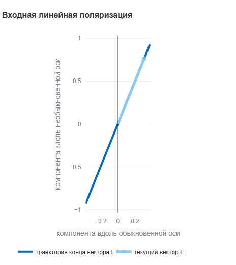
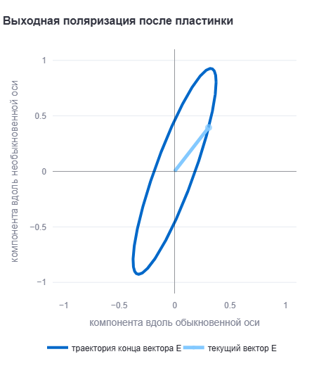
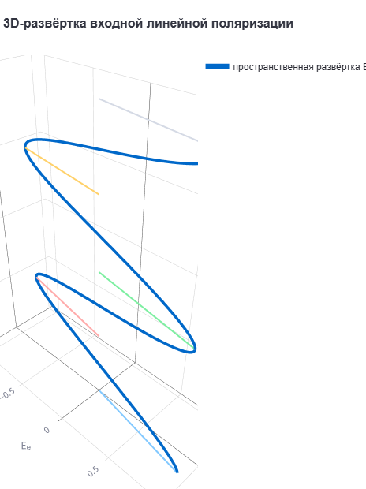
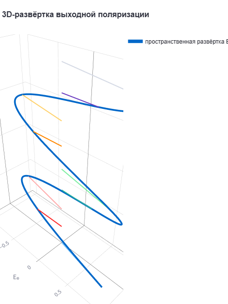
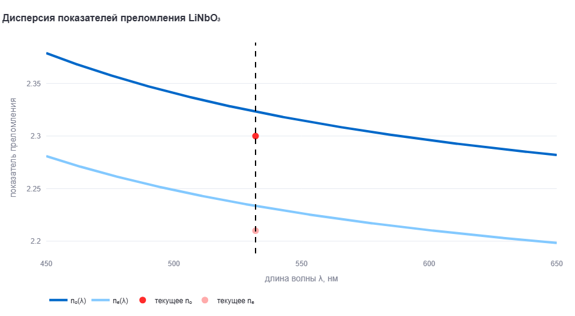
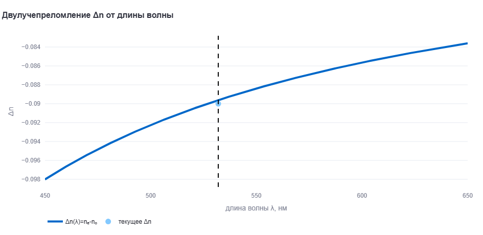
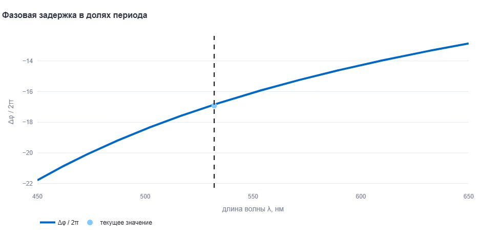
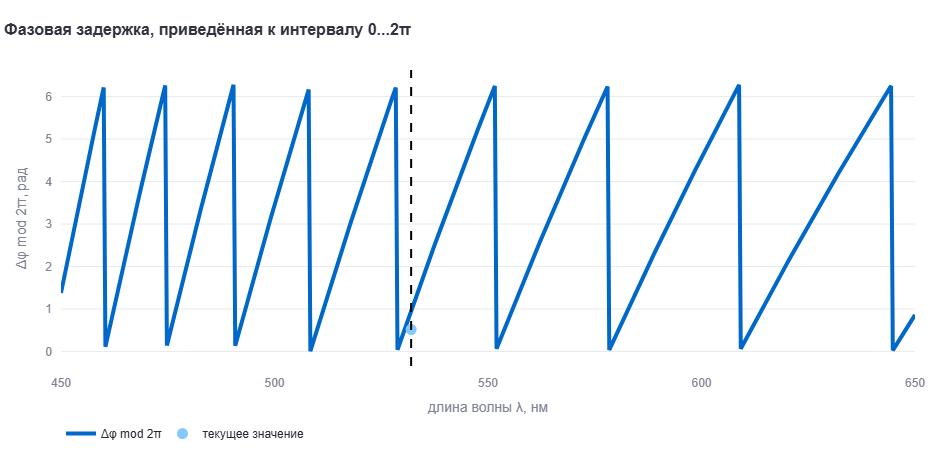
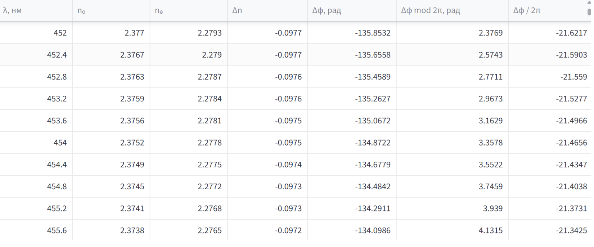

# Моделирование изменения поляризации света в пластинке LiNbO₃

**Студент:** Кирилл Голованов  
**Группа:** М3207  
**Задание:** №4. Поляризация в пластинке LiNbO₃

---

## 1. Постановка задачи

Необходимо смоделировать изменение состояния поляризации линейно поляризованного света при прохождении через кристаллическую пластинку LiNbO₃.

В задаче задаются:

- длина волны света λ в диапазоне 450–650 нм;
- толщина кристаллической пластинки d;
- разность показателей преломления для двух взаимно ортогональных поляризаций;
- формулы зависимости показателей преломления nₑ и nₒ от длины волны λ.

В результате моделирования необходимо показать состояние поляризации на входе и на выходе пластинки.

В выполненной программе дополнительно реализованы спектральные графики, расчёт фазовой задержки, 3D-визуализация, моделирование прохождения света через анализатор и таблица расчётных значений.

---

## 2. Цель работы

Цель работы — построить интерактивную модель, которая показывает, как кристаллическая пластинка LiNbO₃ изменяет состояние поляризации проходящего через неё света.

Для достижения цели необходимо:

1. Рассчитать показатели преломления nₒ и nₑ для выбранной длины волны.
2. Найти разность показателей преломления Δn.
3. Рассчитать фазовую задержку между ортогональными компонентами электрического поля.
4. Построить входную линейную поляризацию.
5. Построить выходную поляризацию после прохождения через пластинку.
6. Показать, как результат меняется при изменении длины волны, толщины пластинки и угла входной поляризации.

---

## 3. Физический смысл задачи

Линейно поляризованный свет можно представить как сумму двух взаимно ортогональных компонент электрического поля.

В кристалле LiNbO₃ эти компоненты распространяются по-разному, потому что для них действуют разные показатели преломления:

- nₒ — показатель преломления для обыкновенной волны;
- nₑ — показатель преломления для необыкновенной волны.

Из-за различия показателей преломления одна компонента света проходит пластинку с другой фазой, чем вторая компонента. Поэтому после выхода из пластинки состояние поляризации может измениться.

Если фазовый сдвиг равен 0 или π, поляризация остаётся линейной. Если фазовый сдвиг близок к π/2, а амплитуды компонент одинаковы, поляризация становится близкой к круговой. В общем случае получается эллиптическая поляризация.

---

## 4. Используемая физическая модель

Входной свет считается линейно поляризованным. Его электрическое поле раскладывается на две компоненты вдоль обыкновенной и необыкновенной осей кристалла.

Если угол входной линейной поляризации равен α, то амплитуды компонент равны:

```text
Aₒ = cos(α)
Aₑ = sin(α)
```

После прохождения через пластинку между компонентами появляется фазовая задержка:

```text
Δφ = 2π · d · (nₑ − nₒ) / λ
```

где:

- Δφ — фазовая задержка между компонентами;
- d — толщина пластинки;
- λ — длина волны света;
- nₑ − nₒ — разность показателей преломления.

В модели длина волны переводится в микрометры, потому что формулы для LiNbO₃ используют λ в микрометрах.

Состояние электрического поля на выходе описывается выражениями:

```text
Eₒ(t) = Aₒ · cos(ωt)
Eₑ(t) = Aₑ · cos(ωt + Δφ)
```

На входе обе компоненты синфазны. На выходе одна компонента получает дополнительный фазовый сдвиг, поэтому форма поляризации может измениться.

---

## 5. Показатели преломления LiNbO₃

В программе используются формулы, заданные в условии работы.

Для необыкновенной волны:

```text
nₑ² = 1 + 2.9804 / (1 − 0.02047 / λ²)
        + 0.5981 / (1 − 0.0666 / λ²)
        + 8.9543 / (1 − 416.08 / λ²)
```

Для обыкновенной волны:

```text
nₒ² = 1 + 2.6734 / (1 − 0.01764 / λ²)
        + 1.2290 / (1 − 0.05914 / λ²)
        + 12.614 / (1 − 474.60 / λ²)
```

Здесь λ берётся в микрометрах. В интерфейсе пользователь задаёт длину волны в нанометрах, а программа автоматически переводит её в микрометры.

После вычисления nₒ и nₑ программа находит:

```text
Δn = nₑ − nₒ
```

Затем по Δn рассчитывается фазовая задержка Δφ.

---

## 6. Что моделирует программа

Программа не просто выполняет один численный расчёт. Она показывает изменение состояния поляризации в зависимости от выбранных параметров.

Пользователь может менять:

- длину волны λ;
- толщину пластинки d;
- угол входной линейной поляризации α;
- фазу времени для отображения текущего вектора E;
- угол анализатора;
- число точек для построения кривой поляризации;
- способ задания показателей преломления.

При изменении параметров все графики и численные значения пересчитываются автоматически. Поэтому можно наблюдать, как изменение длины волны или толщины пластинки влияет на фазовый сдвиг и форму выходной поляризации.

---

## 7. Интерфейс приложения

Приложение запускается в браузере и состоит из боковой панели параметров и нескольких вкладок с результатами моделирования.

### 7.1. Боковая панель

В боковой панели задаются основные параметры модели:

| Параметр | Смысл |
|---|---|
| Длина волны λ | длина волны проходящего света |
| Толщина пластинки d | толщина кристалла LiNbO₃ |
| Угол входной поляризации α | направление входной линейной поляризации |
| Фаза времени | момент времени, в который отображается текущий вектор электрического поля |
| Угол анализатора | направление линейного анализатора для расчёта интенсивности |
| Количество точек | точность построения кривой поляризации |
| Показатели преломления | выбор между формулами из задания и ручным заданием Δn |

Основной режим работы использует формулы LiNbO₃ из условия задания.

---

## 8. Основные расчётные значения

В верхней части приложения выводятся текущие численные результаты:

| Величина | Что означает |
|---|---|
| nₒ | показатель преломления для обыкновенной волны |
| nₑ | показатель преломления для необыкновенной волны |
| Δn | разность показателей преломления |
| Δφ mod 2π | фазовая задержка, приведённая к интервалу от 0 до 2π |
| Выход | тип выходной поляризации |

Тип выходной поляризации определяется автоматически. Возможные варианты:

- линейная;
- эллиптическая;
- близкая к круговой.

---

## 9. Входная и выходная поляризация

На вкладке «Вход и выход» показаны две основные картины: входная линейная поляризация и выходная поляризация после прохождения через пластинку.

### 9.1. Входная линейная поляризация

На входе конец вектора электрического поля движется по прямой линии. Это соответствует линейной поляризации.



**Рисунок 1 — Входная линейная поляризация.**

### 9.2. Выходная поляризация после пластинки

На выходе между ортогональными компонентами появляется фазовая задержка. Поэтому конец вектора электрического поля в общем случае начинает двигаться по эллипсу. Это означает, что линейная поляризация преобразовалась в эллиптическую.



**Рисунок 2 — Выходная поляризация после прохождения через пластинку LiNbO₃.**

---

## 10. 3D-визуализация

На вкладке «3D-визуализация» показана пространственная развёртка электрического поля вдоль направления распространения света.

3D-представление нужно для наглядного понимания того, как меняется поляризация:

- для линейной поляризации вектор электрического поля колеблется в одной плоскости;
- для эллиптической поляризации конец вектора описывает эллиптическую траекторию;
- для круговой поляризации пространственная картина приближается к равномерной спирали.

### 10.1. 3D-развёртка входной поляризации



**Рисунок 3 — 3D-развёртка входной линейной поляризации.**

### 10.2. 3D-развёртка выходной поляризации



**Рисунок 4 — 3D-развёртка выходной поляризации после прохождения через пластинку.**

---

## 11. Спектральные зависимости

На вкладке «Спектральные зависимости» строятся графики зависимости показателей преломления от длины волны.

Первый график показывает дисперсию LiNbO₃:

```text
nₒ = nₒ(λ)
nₑ = nₑ(λ)
```

На графике отмечается текущая выбранная длина волны.



**Рисунок 5 — Зависимость nₒ и nₑ от длины волны.**

Второй график показывает двулучепреломление:

```text
Δn(λ) = nₑ(λ) − nₒ(λ)
```



**Рисунок 6 — Зависимость Δn от длины волны.**

Эти графики важны, потому что изменение длины волны влияет на показатели преломления, а значит и на фазовую задержку между компонентами света.

---

## 12. Фазовая задержка и анализатор

На вкладке «Фазовая задержка и анализатор» показано, как фазовая задержка зависит от длины волны.

Фазовая задержка рассчитывается по формуле:

```text
Δφ = 2π · d · Δn / λ
```

Для анализа удобно рассматривать её в двух видах:

```text
Δφ / 2π
```

и

```text
Δφ mod 2π
```

Первое значение показывает полную задержку в долях периода, а второе показывает фазу, приведённую к одному периоду.



**Рисунок 7 — Зависимость фазовой задержки от длины волны.**

Также на этой вкладке строится зависимость интенсивности после линейного анализатора от угла анализатора.

Это нужно для дополнительной проверки состояния поляризации. Если поляризация линейная, интенсивность после анализатора меняется по закону, похожему на закон Малюса. Если поляризация эллиптическая, зависимость становится другой, потому что компоненты поля имеют фазовый сдвиг.



**Рисунок 8 — Зависимость интенсивности после линейного анализатора от угла анализатора.**

---

## 13. Таблица и экспорт

На вкладке «Таблица и экспорт» выводятся расчётные таблицы.

Первая таблица содержит текущие параметры и результаты для выбранной длины волны:

- λ;
- d;
- угол входной поляризации;
- nₒ;
- nₑ;
- Δn;
- Δφ;
- Δφ mod 2π;
- Δφ / 2π;
- тип выходной поляризации;
- угол ориентации эллипса;
- эллиптичность;
- отношение малой полуоси к большой.

Вторая таблица содержит расчёт по диапазону длин волн 450–650 нм. Для каждой длины волны вычисляются nₒ, nₑ, Δn и фазовая задержка.



**Рисунок 9 — Таблица расчётных значений и экспорт данных.**

Также в приложении предусмотрена возможность скачать данные в формате CSV. Это удобно для проверки расчётов и дальнейшего анализа.

---

## 14. Алгоритм работы программы

Алгоритм моделирования следующий:

1. Пользователь задаёт параметры света и пластинки.
2. Программа переводит длину волны из нанометров в микрометры.
3. По формулам LiNbO₃ вычисляются nₒ и nₑ.
4. Рассчитывается разность показателей преломления Δn.
5. По толщине пластинки и длине волны вычисляется фазовая задержка Δφ.
6. Входное поле раскладывается на две ортогональные компоненты.
7. Для входа строится линейная поляризация без фазового сдвига.
8. Для выхода строится поляризация с учётом фазового сдвига.
9. Определяется тип выходной поляризации.
10. Строятся графики спектральных зависимостей и фазовой задержки.
11. Рассчитывается интенсивность после анализатора.
12. Формируются таблицы расчётных значений.

---

## 15. Пример расчёта для стандартных параметров

Для стандартных параметров приложения:

| Параметр | Значение |
|---|---:|
| Длина волны λ | 532 нм |
| Толщина пластинки d | 100 мкм |
| Угол входной поляризации α | 45° |

получаются значения примерно:

| Величина | Значение |
|---|---:|
| nₒ | 2.32319 |
| nₑ | 2.23357 |
| Δn | −0.08962 |
| Δφ | −105.850 рад |
| Δφ mod 2π | 0.964 рад |
| Δφ / 2π | −16.847 |
| Тип выходной поляризации | эллиптическая |

Знак Δn показывает, какая из компонент распространяется с большим или меньшим показателем преломления. Для формы поляризации важна фазовая задержка, приведённая к интервалу одного периода, то есть Δφ mod 2π.

---

## 16. Запуск программы

Для запуска приложения необходимо установить библиотеки:

```bash
pip install streamlit numpy pandas plotly
```

Затем запустить файл:

```bash
streamlit run mod2_lithium_niobate.py
```

После запуска приложение открывается в браузере по адресу:

```text
http://localhost:8501
```

---


## 17. Вывод

В работе выполнено моделирование изменения состояния поляризации линейно поляризованного света при прохождении через кристаллическую пластинку LiNbO₃.

Программа использует заданные в условии формулы для показателей преломления nₒ и nₑ в диапазоне 450–650 нм. На их основе вычисляются разность показателей преломления, фазовая задержка и состояние выходной поляризации.

Модель показывает, что из-за различия nₒ и nₑ между ортогональными компонентами электрического поля появляется фазовый сдвиг. Поэтому после прохождения через пластинку входная линейная поляризация в общем случае превращается в эллиптическую.

В приложении реализованы интерактивные параметры, визуализация входной и выходной поляризации, 3D-представление электрического поля, спектральные графики, анализатор и таблицы расчётных значений. Это позволяет рассматривать работу пластинки LiNbO₃ не как один численный расчёт, а как полноценную интерактивную модель изменения поляризации света.
