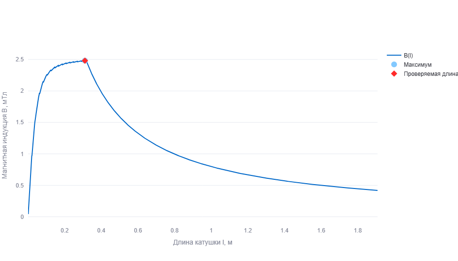
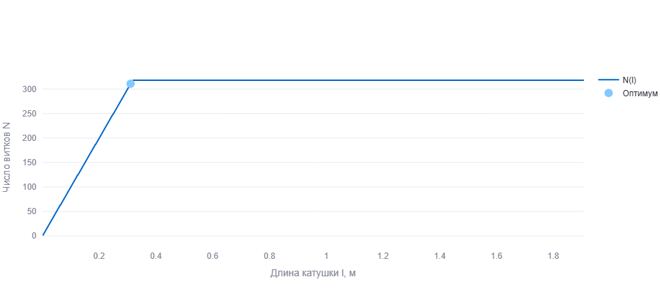
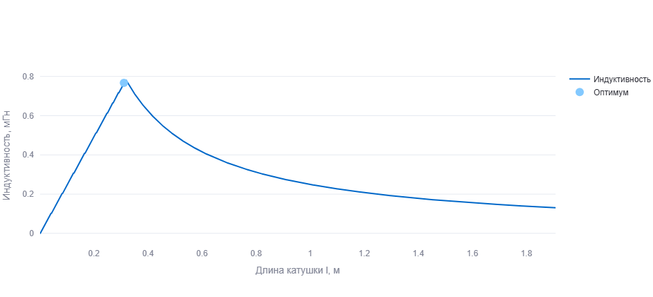
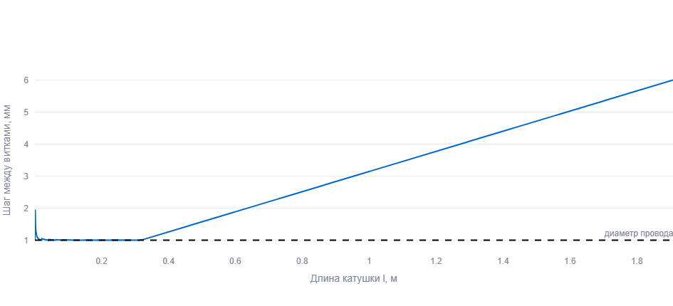
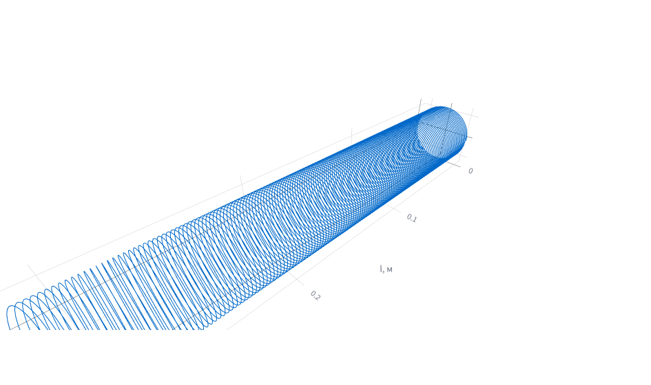
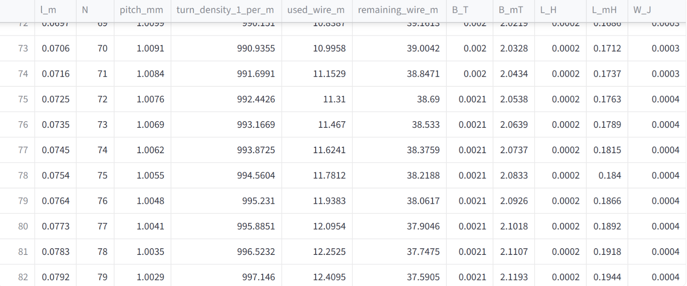

# Отчёт по моделированию физических процессов

## Задача 2. Оптимизация катушки

**Студент:** Кирилл Голованов  
**Группа:** М3207  
**Задание:** №2 «Оптимизация катушки»

---

## Цель работы

Цель работы — разработать интерактивную модель катушки, наматываемой из провода заданной длины на цилиндрический каркас, и определить такую длину катушки, при которой магнитная индукция на оси катушки в центре будет максимальной.

В работе необходимо:

- задать параметры провода и каркаса;
- смоделировать разные варианты длины катушки;
- для каждого варианта рассчитать число витков, шаг намотки, магнитную индукцию и индуктивность;
- найти оптимальную длину катушки;
- построить график зависимости магнитной индукции от длины катушки;
- реализовать интерактивное приложение, в котором параметры можно изменять.

---

## Постановка задачи

Дан провод длиной **L** и диаметром **d**. Из этого провода требуется намотать катушку на цилиндрический каркас диаметром **D** и длиной **l** так, чтобы получить максимальную магнитную индукцию в центре катушки на её оси.

В программе длина катушки **l** не задаётся только одним фиксированным числом. Вместо этого программа перебирает допустимый диапазон длин, рассчитывает физические параметры для каждого варианта и выбирает тот вариант, при котором магнитная индукция максимальна.

---

## Используемые параметры

В приложении пользователь задаёт следующие параметры:

| Обозначение | Смысл | Единица измерения |
|---|---|---|
| **L** | длина провода | м |
| **d** | диаметр провода | мм |
| **D** | диаметр цилиндрического каркаса | см |
| **I** | сила тока в катушке | А |
| **μᵣ** | относительная магнитная проницаемость среды | безразмерная |
| **l** | длина катушки | м |

Для стандартного расчёта использованы значения:

<p align="center"><b>L = 50 м, &nbsp;&nbsp; d = 1 мм, &nbsp;&nbsp; D = 5 см, &nbsp;&nbsp; I = 2 А, &nbsp;&nbsp; μᵣ = 1</b></p>

Значение **μᵣ = 1** соответствует воздуху или немагнитному сердечнику.

---

## Физическая модель

Катушка рассматривается как конечный соленоид. Провод наматывается на цилиндрический каркас равномерно по всей длине катушки. Это означает, что витки не собираются в одной части каркаса, а распределяются с одинаковым шагом.

Радиус каркаса:

<p align="center"><b>R = D / 2</b></p>

Длина одного кругового витка приблизительно равна длине окружности каркаса:

<p align="center"><b>c = πD</b></p>

Но в модели провод наматывается не просто отдельными окружностями, а по винтовой линии. Поэтому использованная длина провода для катушки длиной **l** и числом витков **N** оценивается так:

<p align="center"><b>L<sub>исп</sub> = √((NπD)<sup>2</sup> + l<sup>2</sup>)</b></p>

При этом должно выполняться условие:

<p align="center"><b>L<sub>исп</sub> ≤ L</b></p>

То есть модель не может использовать больше провода, чем задано изначально.

---

## Ограничение по диаметру провода

Провод имеет ненулевой диаметр **d**, поэтому витки нельзя располагать сколь угодно близко друг к другу. Если катушка имеет длину **l**, а число витков равно **N**, то шаг равномерной намотки равен:

<p align="center"><b>p = l / N</b></p>

Чтобы витки физически помещались на каркас, шаг намотки должен быть не меньше диаметра провода:

<p align="center"><b>p ≥ d</b></p>

Отсюда следует ограничение на число витков:

<p align="center"><b>N ≤ l / d</b></p>

Это ограничение важно, потому что при слишком маленькой длине катушки нельзя разместить много витков: им просто не хватит места по длине каркаса.

---

## Выбор числа витков

Для каждой длины катушки программа определяет максимально допустимое целое число витков. Учитываются два ограничения:

1. должна хватить заданная длина провода;
2. витки должны поместиться по длине катушки с учётом диаметра провода.

В модели используется зависимость:

<p align="center"><b>N(l) = ⌊ min( √(L<sup>2</sup> − l<sup>2</sup>) / (πD), &nbsp; l / d ) ⌋</b></p>

Знак **⌊...⌋** означает округление вниз до целого числа. Это сделано потому, что в реальной катушке нельзя намотать дробное число витков.

Такой подход делает модель более реалистичной: число витков не задаётся заранее вручную, а рассчитывается автоматически для каждой возможной длины катушки.

---

## Расчёт магнитной индукции

Магнитная индукция в центре конечного соленоида рассчитывается по формуле:

<p align="center"><b>B(l) = μ₀ μᵣ N(l) I / √(l<sup>2</sup> + D<sup>2</sup>)</b></p>

где:

| Обозначение | Смысл |
|---|---|
| **B(l)** | магнитная индукция в центре катушки |
| **μ₀** | магнитная постоянная, μ₀ = 4π · 10⁻⁷ Гн/м |
| **μᵣ** | относительная магнитная проницаемость среды |
| **N(l)** | число витков при выбранной длине катушки |
| **I** | сила тока |
| **l** | длина катушки |
| **D** | диаметр каркаса |

В этой формуле учитывается конечная длина катушки. Чем больше витков и ток, тем больше магнитная индукция. При этом увеличение длины катушки не всегда полезно: витки распределяются на большей длине, и поле в центре может уменьшаться.

---

## Расчёт индуктивности

Индуктивность катушки рассчитывается по приближённой формуле для соленоида:

<p align="center"><b>L<sub>кат</sub>(l) = μ₀ μᵣ N(l)<sup>2</sup> S / l</b></p>

Площадь поперечного сечения катушки:

<p align="center"><b>S = πD<sup>2</sup> / 4</b></p>

Индуктивность зависит от числа витков, площади сечения и длины катушки. Чем больше число витков, тем больше индуктивность. При увеличении длины катушки индуктивность обычно уменьшается, если остальные параметры не компенсируют это изменение.

Дополнительно в программе рассчитывается энергия магнитного поля:

<p align="center"><b>W = L<sub>кат</sub>I<sup>2</sup> / 2</b></p>

Эта величина не требуется напрямую в условии, но она добавлена как дополнительная физическая характеристика получившейся катушки.

---

## Алгоритм работы программы

Программа работает следующим образом:

1. Пользователь задаёт параметры **L**, **d**, **D**, **I** и **μᵣ**.
2. Программа формирует набор возможных значений длины катушки **l**.
3. Для каждого значения **l** рассчитывается допустимое число витков **N(l)**.
4. Невозможные варианты отбрасываются.
5. Для каждого допустимого варианта рассчитываются:
   - шаг намотки;
   - использованная длина провода;
   - остаток провода;
   - магнитная индукция;
   - индуктивность;
   - энергия магнитного поля.
6. Среди всех вариантов выбирается тот, где магнитная индукция **B(l)** максимальна.
7. Результаты выводятся в виде чисел, графиков, таблицы и 3D-визуализации.

---

## Описание интерфейса приложения

Приложение реализовано как интерактивная веб-модель. Оно запускается локально и открывается в браузере.

В боковой панели задаются исходные параметры:

- длина провода;
- диаметр провода;
- диаметр каркаса;
- ток;
- относительная магнитная проницаемость;
- диапазон длин катушки;
- количество точек моделирования;
- проверяемая длина катушки.

При изменении любого параметра расчёт автоматически выполняется заново. Поэтому пользователь может исследовать, как изменение параметров влияет на оптимальную длину катушки, число витков, магнитную индукцию и индуктивность.

В верхней части приложения выводятся основные результаты для оптимального варианта:

- оптимальное число витков;
- оптимальная длина катушки;
- максимальная магнитная индукция;
- индуктивность получившейся катушки;
- шаг намотки;
- использованная длина провода;
- остаток провода;
- энергия магнитного поля.

Отдельно в интерфейсе предусмотрена вкладка **«Таблица и экспорт»**. Она содержит полную таблицу расчётов по всем значениям длины катушки, использованным при моделировании.

---

## Графики, таблица и визуализации

### Главный график: зависимость B от l

Главный график показывает зависимость магнитной индукции от длины катушки:

<p align="center"><b>B = f(l)</b></p>

На графике отмечаются:

- вся зависимость **B(l)**;
- точка максимума;
- выбранная пользователем проверяемая длина катушки.

Этот график является основным требованием задания. По нему видно, при какой длине катушки магнитная индукция в центре достигает максимального значения.



**Рисунок 1 — зависимость магнитной индукции B от длины катушки l.**

---

### График числа витков

График **N(l)** показывает, как меняется число витков при изменении длины катушки.

При малой длине катушки число витков ограничено толщиной провода. При увеличении длины катушки витков можно разместить больше, но при слишком большой длине поле в центре начинает уменьшаться из-за растяжения катушки.



**Рисунок 2 — зависимость числа витков N от длины катушки l.**

---

### График индуктивности

График индуктивности показывает, как меняется величина **L<sub>кат</sub>** при изменении длины катушки.

Этот график является дополнительным, но он полезен для отчёта, потому что по условию нужно определить индуктивность получившейся катушки.



**Рисунок 3 — зависимость индуктивности катушки от длины l.**

---

### График шага намотки

График шага намотки показывает величину:

<p align="center"><b>p = l / N</b></p>

На графике также отмечается диаметр провода. Это позволяет проверить, что витки не налезают друг на друга и распределены по длине катушки равномерно.



**Рисунок 4 — зависимость шага намотки от длины катушки.**

---

### 3D-визуализация намотки

В приложении есть 3D-визуализация катушки. Провод показан как винтовая линия на цилиндрическом каркасе.

Эта визуализация нужна для того, чтобы показать не только графики, но и сам объект моделирования: как именно провод равномерно распределяется вдоль длины катушки.



**Рисунок 5 — 3D-визуализация равномерной намотки катушки.**

---

### Таблица расчётных значений

В приложении также есть вкладка **«Таблица и экспорт»**. В ней выводится таблица расчётных значений для всех рассмотренных вариантов длины катушки.

Для каждого значения длины **l** в таблице указаны:

- длина катушки;
- число витков **N**;
- шаг намотки **p**;
- использованная длина провода;
- остаток провода;
- магнитная индукция **B**;
- индуктивность катушки;
- энергия магнитного поля.

Таблица нужна для того, чтобы результаты моделирования можно было не только посмотреть на графиках, но и проверить численно. Также из приложения можно скачать таблицу в формате CSV для дальнейшей обработки или вставки в отчёт.



**Рисунок 6 — таблица расчётных значений для разных длин катушки.**

---

## Численный пример

При стандартных параметрах:

<p align="center"><b>L = 50 м, &nbsp;&nbsp; d = 1 мм, &nbsp;&nbsp; D = 5 см, &nbsp;&nbsp; I = 2 А, &nbsp;&nbsp; μᵣ = 1</b></p>

программа получает следующие значения:

| Величина | Значение |
|---|---:|
| Оптимальное число витков | 315 |
| Оптимальная длина катушки | 0,3152 м |
| Шаг намотки | 1,001 мм |
| Максимальная магнитная индукция | 2,4804 мТл |
| Индуктивность | 0,7767 мГн |
| Использованная длина провода | 49,481 м |
| Остаток провода | 0,519 м |
| Энергия магнитного поля | 1,553334 мДж |

Небольшие отличия в последних цифрах возможны при изменении количества точек моделирования, так как максимум ищется по дискретному набору значений длины катушки.

---

## Физический смысл результата

Максимальная магнитная индукция получается не при произвольной длине катушки, а при балансе двух факторов.

Если катушка слишком короткая, то в неё нельзя поместить много витков: этому мешает конечный диаметр провода. В этом случае число витков ограничивается условием **p ≥ d**, поэтому магнитная индукция оказывается меньше.

Если катушка слишком длинная, витки распределяются на большой длине. Плотность намотки уменьшается, и магнитное поле в центре также становится меньше.

Поэтому существует оптимальная длина катушки. Вблизи этой длины используется почти весь провод, шаг намотки близок к диаметру провода, а число витков достаточно велико. Именно в этой области магнитная индукция в центре достигает максимума.

---

## Запуск программы

Для запуска приложения используется команда:

```bash
streamlit run mod1_coil.py
```

После запуска приложение открывается в браузере по адресу:

```text
http://localhost:8501
```

Если браузер не открылся автоматически, адрес можно скопировать из терминала и открыть вручную.

---

## Вывод

В ходе работы была создана интерактивная модель оптимизации катушки. Программа позволяет задавать параметры провода, каркаса и тока, после чего автоматически рассчитывает возможные варианты намотки.

Для каждого значения длины катушки определяется допустимое число витков, шаг намотки, использованная длина провода, магнитная индукция и индуктивность. Затем программа находит такую длину катушки, при которой магнитная индукция в центре максимальна.

При стандартных параметрах максимум достигается при плотной равномерной намотке, когда шаг между витками близок к диаметру провода, а используется почти вся длина провода. Это соответствует физическому смыслу задачи: сильное магнитное поле создаётся большим числом витков, расположенных достаточно компактно.

Таким образом, требования задания выполнены: параметры задаются, построена зависимость **B = f(l)**, найден максимум магнитной индукции, рассчитана индуктивность получившейся катушки и реализована интерактивная визуализация модели.
